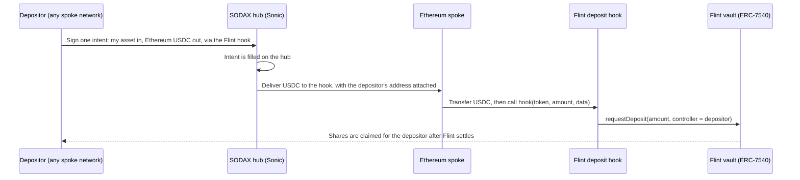

On August 27, 2026, SODAX and Flint [announced](https://sodax.com/news/sodax-partners-with-flint-to-power-cross-network-deposits-for-its-real-world-asset-vaults) an integration for Flint's real-world-asset vaults: any asset a depositor holds, on any of the <span data-sodax-config="count" data-metric="networks">20+</span> networks SODAX supports, EVM and non-EVM alike, can now fund a Flint vault position.

This page covers how that works and why it took more than a swap.

## The starting point

A Flint vault accepts one asset on one network: USDC on Ethereum. Depositors rarely hold exactly that. Their capital sits in other tokens on other networks, from Sonic and Solana to Stellar and Sui.

The goal was for every one of those holders to reach a vault position without first becoming an Ethereum USDC holder by hand.

## Why a plain swap was not enough

SODAX already moves value between networks with intents. A plain cross-network swap could take a depositor's asset and land USDC in their Ethereum wallet. The depositor would then still need to:

1. Hold ETH for gas on Ethereum.
2. Approve the vault to pull their USDC.
3. Submit a deposit request to the vault themselves.

Flint's vault also follows ERC-7540, the asynchronous vault standard. A deposit is a *request* recorded against an account (the controller). Shares are minted later, when the vault settles, and the controller is who owns them. So the deposit has to name the depositor as controller, not whatever contract happened to carry the funds.

A swap gets the money to the right network. Flint needed the money to arrive as a vault position, so SODAX built a custom integration shaped around Flint's vault.

## What SODAX built

The answer is a **delivery hook**: a small contract on Ethereum that receives the output of a SODAX intent and acts on it in the same delivery.

SODAX is a hub-and-spoke system. Each supported network is a spoke, and the hub runs on Sonic. Here is the full path of a Flint deposit:



Step by step:

1. **Intent on the source network.** The depositor signs one intent where their asset lives. The output is set to USDC on Ethereum, and the delivery target is the Flint hook rather than their own wallet.
2. **Execution on the Sonic hub.** The intent is filled on the hub like any other SODAX swap.
3. **Delivery with data.** The output is delivered on Ethereum together with a small payload that names the depositor. The Ethereum spoke contract transfers the USDC to the hook and calls its `hook` function.
4. **Deposit request.** The hook calls the vault's `requestDeposit` with the depositor as the ERC-7540 controller. The request, and the shares it settles into, belong to the depositor. The hook holds nothing afterwards.

The hook is built so a delivery always lands somewhere useful. If a deposit cannot be made, for example because the amount is under the hook's minimum or the vault is not accepting requests, the depositor receives the USDC directly in their Ethereum wallet instead.

## Using it from the SDK

The hook is registered in the public [`@sodax/sdk`](https://github.com/icon-project/sodax-sdks). Builders pick it by name and the SDK fills in the deployed hook address and encodes the payload, so the two can never drift apart.

A Flint deposit is an ordinary intent with one extra field:

```typescript
import { HookKind, ChainKeys, spokeChainConfig, type CreateIntentParams } from '@sodax/sdk';

const usdc = spokeChainConfig[ChainKeys.ETHEREUM_MAINNET].supportedTokens.USDC.address;

const params: CreateIntentParams<typeof ChainKeys.SONIC_MAINNET> = {
  inputToken: sToken,                     // native S on Sonic in this example
  outputToken: usdc,                       // the vault's underlying asset
  inputAmount,
  minOutputAmount,
  deadline,
  allowPartialFill: false,
  srcChainKey: ChainKeys.SONIC_MAINNET,
  dstChainKey: ChainKeys.ETHEREUM_MAINNET,
  srcAddress: walletAddress,
  dstAddress: depositor,                   // the account that will own the vault position
  solver: '0x0000000000000000000000000000000000000000',
  data: '0x',
  hook: { kind: HookKind.FLINT_DEPOSIT },  // route the output into the Flint vault
};

const result = await sodax.swaps.swap({ params, raw: false, walletProvider });
```

With `hook` set, `dstAddress` keeps its plain meaning: the person being credited. The SDK swaps the real delivery target for the hook's address behind the scenes.

<Note>
  The repo includes a runnable version of this flow at `apps/node/src/flint-deposit.ts` (`pnpm flint-deposit`). It defaults to a dry run that prints the quote and the built intent, and reads the hook's live minimum deposit before submitting.
</Note>

## What it means for depositors

- **Any asset, any network.** Funds can start on any of the <span data-sodax-config="count" data-metric="networks">20+</span> networks SODAX supports, EVM and non-EVM.
- **One signature.** The depositor signs one intent, on the network where the asset already sits. No bridging step, no ETH for Ethereum gas, no separate vault transaction.
- **The position is theirs.** The vault request is recorded against the depositor's own address from the start.

## The lesson for builders

The Flint hook is a custom build, and it sits on a general mechanism. When SODAX delivers an intent's output on a spoke network, the spoke can hand those tokens to a receiver contract and call its `hook(token, amount, data)` with a payload chosen at intent time. Any contract that implements that receiver interface can turn a delivery into an action.

Flint is not the only hook in the SDK registry. A second one, for Hyperliquid, deposits delivered USDC straight into a HyperCore trading account on HyperEVM. Both are selected the same way, with a `HookKind`, and the registry is designed to hold many hooks per network. For receivers not yet in the registry, intents also accept raw `deliveryData` aimed at a custom receiver address.

So the pattern is open: if your product needs value from many networks to arrive as a position, a deposit or an account credit rather than a wallet balance, a delivery hook is the place to put that logic. Each hook is a focused contract shaped around one partner's flow, exactly as the Flint hook was shaped around an ERC-7540 vault.
