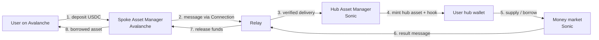

If you integrate SODAX on Avalanche, your users can supply collateral and borrow against it. Yet there are no money market contracts on Avalanche. The same is true for most networks SODAX connects to. This is not a shortcut or a wrapper around someone else's protocol. It is the architecture: **hub and spoke**.

Once this model is clear, the rest of SODAX makes sense: why one SDK covers so many networks, why a position opened on one network can be managed from another, and why adding a network is mostly deployment work rather than rebuilding the product.

## The hub: Sonic

SODAX has one hub, and it is Sonic. Everything functional lives there: the money market contracts, the AMM, intents settlement, vaults and the rest of the core logic. In the SDK this is explicit. `@sodax/types` exports `HUB_CHAIN_KEY`, and it is set to `ChainKeys.SONIC_MAINNET`.

The hub also holds the hub-side infrastructure listed in the [mainnet deployments](/developers/deployments/mainnet): the Hub Asset Manager, the Wallet Factory, Intents, the Lending Manager, rate limits and vault tokens. Because the logic exists in one place, there is one money market, one set of reserves and one source of truth for positions, no matter where a user starts.

## The spokes: every other network

Every other connected network is a **spoke**. A spoke does not run the money market or the AMM. It runs a small, standard set of contracts:

* **Spoke Asset Manager**: holds user assets locally on that network. Deposits are locked here, and withdrawals are released from here.
* **Connection**: verifies incoming messages and acts as the gateway for that network to send messages to any other connected network.
* **Rate limiter**: a standard component that every spoke asset manager consults on withdrawals.

You can see these per network on the [mainnet deployments page](/developers/deployments/mainnet). Avalanche, for example, lists an `AssetManager` and a `RateLimit` contract, and no lending contracts.

The [Asset Manager specification](/developers/technical-overview/asset-manager) spells out what a spoke has to do. It must receive and verify messages from the hub, lock and release native assets, send properly formatted messages to the hub, and enforce rate limits on withdrawals. The implementation language is free. That is why spokes can exist on EVM networks, Solana, Sui, Stellar, NEAR, Injective, ICON and others, each written natively for its own environment.

## The relay: how spokes talk to the hub

Spokes and the hub communicate through relayed messages. The [Generalized Messaging Protocol](/developers/technical-overview/generalized-messaging-protocol) defines the shape: a contract calls `sendMessage` on its network's connection, which emits an event. A **relayer** picks that event up, confirms it and delivers it with signatures to the destination, where `verifyMessage` checks the signatures and records a receipt so the same message can never be processed twice.

From the SDK side you rarely touch this directly. Every cross-network operation (swaps, bridging, money market deposits and withdrawals, staking) submits the spoke transaction to the [intent relay service](/developers/deployments/relayer-api-endpoints) and polls until the hub confirms execution. The high-level methods manage that lifecycle for you and return typed errors such as `RELAY_TIMEOUT` if something needs attention.

## The hub wallet: one identity across networks

When a message arrives on the hub, something has to act on the user's behalf. That is the **hub wallet**. The [Hub Wallet Abstraction](/developers/technical-overview/hub-wallet-abstraction) gives every user a deterministic smart wallet on Sonic, derived with CREATE3 from their origin network ID and address. The same user on the same network always maps to the same hub wallet, and no separate deployment transaction is needed.

The hub wallet is what executes the actual action: supplying to the money market, borrowing, staking. The Asset Manager can call into it through a dedicated hook, so a single deposit message can carry both the asset and the instructions for what to do with it.

## Putting it together: borrowing from Avalanche

Here is what happens when a user on Avalanche supplies USDC and borrows against it.

<Steps>
  <Step title="Deposit on the spoke">
    The user sends USDC to the Spoke Asset Manager on Avalanche. The tokens are locked there, on Avalanche, and a transfer message is built that includes the intended action.
  </Step>
  <Step title="Relay to the hub">
    The message goes out through the Avalanche connection. The relay delivers it to Sonic, where it is verified before anything else happens.
  </Step>
  <Step title="Execute on the hub">
    The Hub Asset Manager mints the hub representation of the deposit to the user's hub wallet and passes along the action data. The hub wallet supplies to the money market and, if requested, borrows.
  </Step>
  <Step title="Represent the result on the spoke">
    When the user withdraws or borrows, the hub sends a message back. The Spoke Asset Manager on Avalanche verifies it and releases the asset to the user on Avalanche.
  </Step>
</Steps>

The user never leaves Avalanche and never bridges manually. Their position lives on Sonic, held by their hub wallet, and it is the same position whether they later interact from Avalanche, Arbitrum or Solana.

<Note>
  In the SDK, the money market `supply` and `borrow` methods are typed over `SpokeChainKey`. You pass the network the user is on, and the SDK resolves the user's hub wallet and handles the relay round trip.
</Note>

## Why build it this way

**One deployment of the logic, many entry points.** The money market, AMM and vaults are written once, on the hub. A spoke only needs the asset manager, connection and rate limiter, which follow a fixed specification.

**Unified liquidity.** Every spoke deposit feeds the same pools on Sonic. [Vault tokens](/developers/technical-overview/vault-token) wrap network-specific variants of the same asset (USDC from several networks, for example) into one unified position, so liquidity is not split per network.

**Consistent behaviour for builders.** Because every action executes in the same place, an app integrating the SDK gets the same money market, the same reserves and the same results on every supported network. Spoke-to-spoke transfers work too: the [bridge](/bridge) module moves assets spoke to hub, hub to spoke and spoke to spoke through the same vaults.

**Deeper quotes over time.** Swaps route through SODAX's liquidity layer, which quotes against the DEXs connected to it. Every new venue is another price point, so apps get better quotes as coverage grows without changing a line of code.

**Fast expansion.** New networks become new spokes, and the product is never redeployed for each one. Adding a network means deploying the standard spoke contracts, connecting it to the relay, integrating the liquidity layer with that network's largest AMM, and publishing the SDK and API update. Most of that work takes a couple of days, and a typical network is live in about a week.

## Where to go next

* [Technical overview](/developers/technical-overview) for the architecture diagram and component deep dives
* [Money market](/money-market) to supply and borrow from any spoke with `@sodax/sdk`
* [Relayer API endpoints](/developers/deployments/relayer-api-endpoints) for relay error handling
* [Mainnet deployments](/developers/deployments/mainnet) for every hub and spoke contract address
